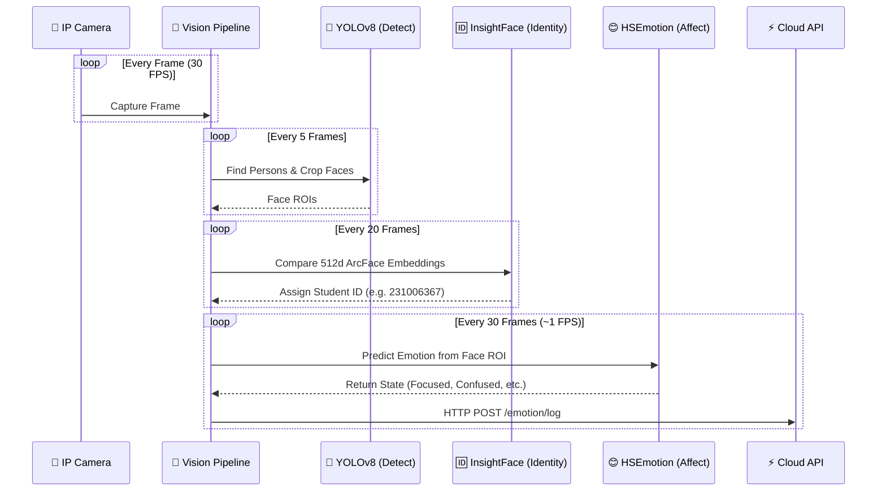
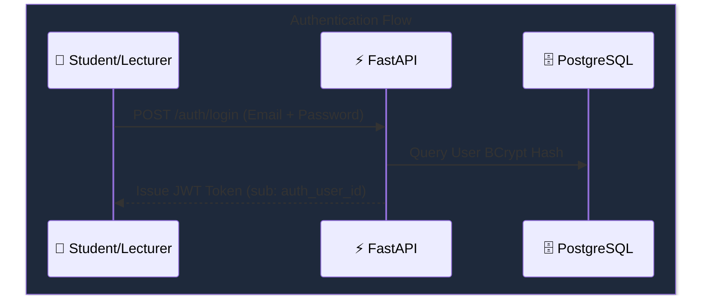
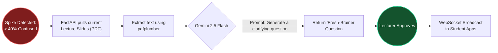
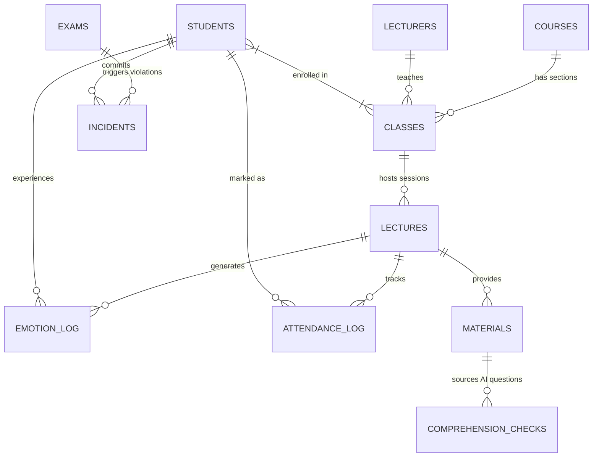

# 🏛️ Classroom Emotion System — Master Architecture
> **Audience:** Engineering & Product Teams. 
> **Purpose:** A creative and comprehensive visualization of the AASTMT Classroom Emotion System's architecture, data flows, and AI integrations.
> **Status:** Production-Ready (FastAPI + PostgreSQL + DigitalOcean + Gemini)

---

## 1. 🌌 The Macro Architecture

Our architecture is a **Hybrid Edge-to-Cloud Pipeline**. It processes heavy computer vision locally in the classroom to ensure privacy and low latency, while offloading analytics, storage, and generative AI to a centralized cloud.

```mermaid
flowchart TD
    %% Custom Styling
    classDef edge fill:#1e293b,stroke:#3b82f6,stroke-width:2px,color:#fff,rx:10px
    classDef cloud fill:#312e81,stroke:#8b5cf6,stroke-width:2px,color:#fff,rx:10px
    classDef db fill:#064e3b,stroke:#10b981,stroke-width:2px,color:#fff,rx:10px
    classDef client fill:#7c2d12,stroke:#f59e0b,stroke-width:2px,color:#fff,rx:10px
    classDef ai fill:#831843,stroke:#ec4899,stroke-width:2px,color:#fff,rx:10px
    classDef dataflow stroke:#cbd5e1,stroke-width:2px,stroke-dasharray: 5 5

    %% -------------------------------------
    %% 1. CLASSROOM EDGE
    %% -------------------------------------
    subgraph Classroom ["🏫 Classroom Edge Layer"]
        direction LR
        Cam(("📸 IP/USB\nCamera\n(30 FPS)"))
        VisNode["🧠 Edge Vision Node\n(Python Pipeline)"]
        
        Cam == "RTSP Stream" ==> VisNode
        
        subgraph Models ["Deep Learning Stack"]
            direction TB
            YoloP("🧍 YOLOv8\n(Persons)")
            YoloF("👤 YOLOv8\n(Faces)")
            ID("🆔 InsightFace\n(ArcFace 512d)")
            HSE("😊 HSEmotion\n(AffectNet)")
            
            YoloP --> YoloF
            YoloF --> ID
            YoloF --> HSE
        end
        VisNode -.-> Models
    end
    class Classroom edge

    %% -------------------------------------
    %% 2. CLOUD INFRASTRUCTURE
    %% -------------------------------------
    subgraph Cloud ["☁️ DigitalOcean Cloud Infrastructure"]
        direction TB
        FastAPI{"⚡ FastAPI\nCentral Hub"}
        
        DB[("🗄️ PostgreSQL\n(Managed DB with WAL)")]
        Spaces[("📦 DO Spaces\n(S3 Evidence Storage)")]
        
        FastAPI <== "ORM / SQL Queries" ==> DB
        FastAPI -. "Image Uploads" .-> Spaces
    end
    class Cloud cloud
    class DB db
    class Spaces db
    class FastAPI cloud

    %% -------------------------------------
    %% 3. GENERATIVE AI 
    %% -------------------------------------
    subgraph GenAI ["✨ Generative AI Engine"]
        direction LR
        Gemini("🤖 Gemini 2.5 Flash")
        ContextExt("📄 Slide Text Extractor\n(pdfplumber)")
        
        ContextExt -. "Injected Context" .-> Gemini
    end
    class GenAI ai
    class Gemini ai
    class ContextExt ai

    %% -------------------------------------
    %% 4. FRONTEND CLIENTS
    %% -------------------------------------
    subgraph Clients ["📱 Client Interfaces"]
        direction LR
        Shiny("📊 R/Shiny Portal\n(Lecturer / Admin)")
        ReactNative("📲 React Native\n(Student App)")
    end
    class Clients client
    class Shiny client
    class ReactNative client

    %% -------------------------------------
    %% GLOBAL CONNECTIONS
    %% -------------------------------------
    VisNode == "Anonymized Logs\n(HTTP POST)" ==> FastAPI
    FastAPI == "Confusion Spike\nTriggers AI" ==> ContextExt
    Gemini == "Fresh-Brainer Qs\n& Action Plans" ==> FastAPI
    
    FastAPI <== "WebSockets\n(Real-time Dashboards)" === Shiny
    FastAPI <== "WebSockets\n(Push Notifications)" === ReactNative
    
    Shiny == "Direct Read\n(RPostgres)" ==> DB

```

---

## 2. 🧩 The Vision Pipeline Breakdown

The **Edge Vision Node** is the workhorse of the system. To maintain a high frame rate while running multiple neural networks, the pipeline is staggered.



### 💡 Why this design?
1. **Privacy-First:** Video frames **never** leave the classroom. Only the computed metadata (Student ID + Emotion) is sent to the cloud.
2. **Performance Optimization:** Running heavy identity matching every 20 frames instead of every frame saves massive CPU/GPU resources while maintaining high tracking accuracy.

---

## 3. 🔐 Security & Identity Flow

The system features a **Hybrid JWT & PostgreSQL** identity architecture.



---

## 4. 🤖 The Gemini AI "Fresh-Brainer" Flow

One of the most innovative features is the automated **Fresh-Brainer** system, designed to combat class-wide confusion in real-time.



---

## 5. 🗄️ Database Architecture (ERD)

The entire system state is stored in a structured, relational PostgreSQL database.



### 📊 Performance Features:
- **Write-Ahead Logging (WAL):** Ensures that the high-velocity writes from the Vision Node don't block analytical reads from the R/Shiny portal.
- **BYTEA Storage:** Stores massive `512-dim` float arrays for face encodings directly in the database for blazing fast nearest-neighbor calculations.
- **Timescale Accuracy:** All timestamps are strictly `TIMESTAMPTZ` (UTC) to guarantee global accuracy during remote exams and logging.
