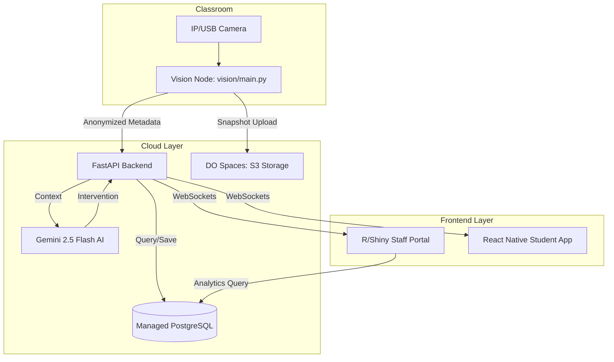
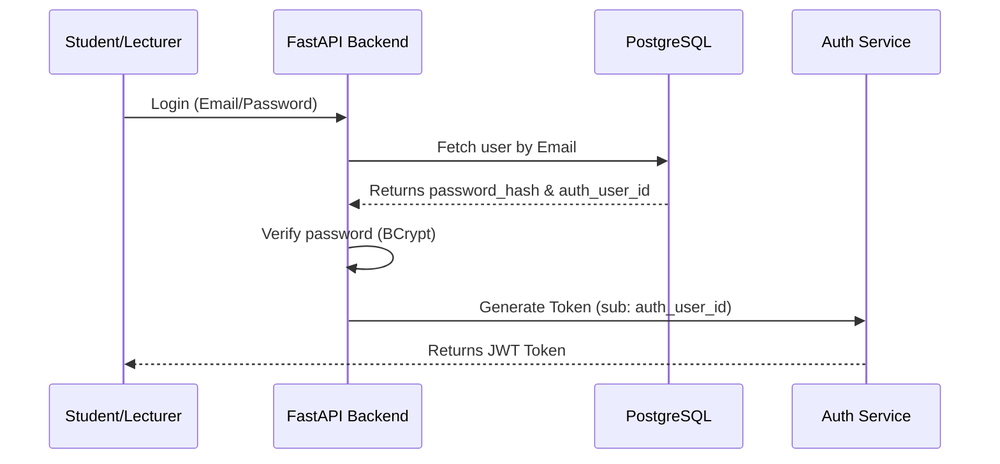
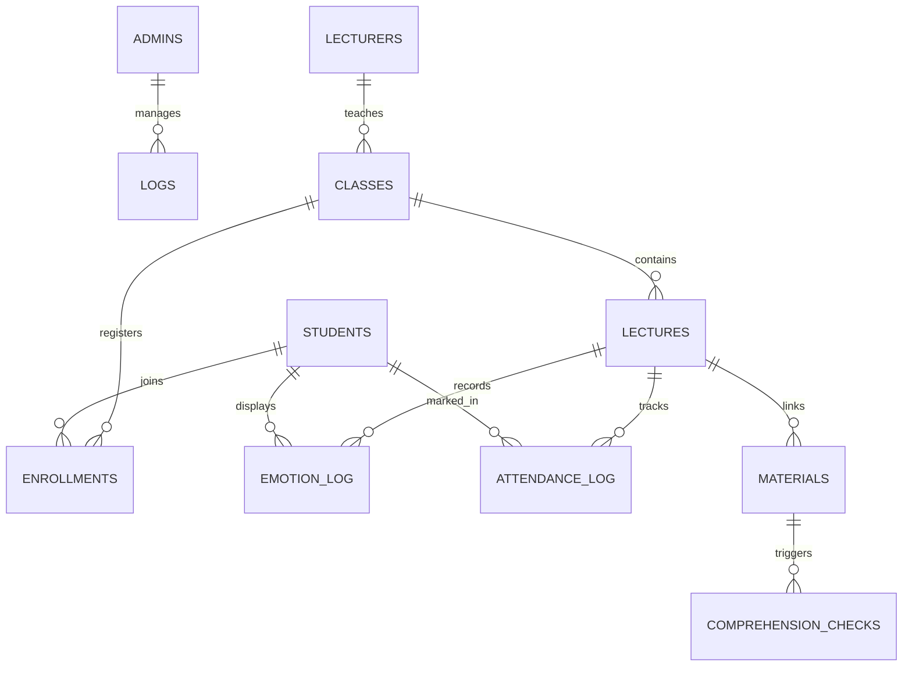
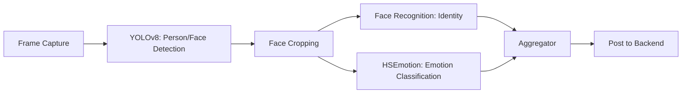

# ARCHITECTURE.md — Logical Architecture & Data Flow Specification
> **Audience:** Engineering team only. This document defines the precise wiring between every subsystem.
> **Status:** Production-Ready (FastAPI + PostgreSQL + Digital Ocean)

---

## 0. System Overview: Consolidated Cloud Architecture

The Classroom Emotion System is a consolidated cloud platform designed for real-time engagement monitoring and automated proctoring.

### 0.1 Centralized Cloud (DigitalOcean)
- **Backend (FastAPI):** Orchestrates business logic, authentication, WebSocket signaling, and AI interventions.
- **Database (Managed PostgreSQL):** Hosted on Digital Ocean. The single source of truth for academic records, user credentials, attendance, and emotion logs.
- **Identity:** Managed directly via the FastAPI auth router using `password_hash` and `auth_user_id` (UUID) in the PostgreSQL user tables.
- **Storage (DO Spaces):** S3-compatible storage for student photos, attendance snapshots, and exam evidence.

### 0.2 Local Vision Nodes (Classroom)
- **Hardware:** Classroom PC/Laptop or Edge Device.
- **Software:** `vision/main.py` or FastAPI Vision Thread.
- **AI Stack:** YOLOv8 (Person/Face detection), face-recognition (Identity), HSEmotion (Emotion classification).
- **Privacy:** Processes video locally; only anonymized metadata and occasional proof-of-presence snapshots are sent to the cloud.

---

## 1. System Topology & Data Flow

### 1.1 High-Level Component Map

---

## 2. Identity & Data Standards

### 2.1 User Identity Flow

### 2.2 Entity Relationship Diagram (ERD)

---

## 3. Data Contracts — PostgreSQL Schema

### `students`
| Column | Type | Description |
| :--- | :--- | :--- |
| `student_id` | TEXT (PK) | Primary academic ID (e.g. 231006367) |
| `auth_user_id` | UUID (Unique) | Internal Unique identifier |
| `password_hash`| TEXT | Securely hashed password |
| `name` | TEXT | English Full Name |
| `email` | TEXT | `[initial][id]@aast.com` |
| `face_encoding`| BYTEA | 128-dim face vector |
| `photo_url` | TEXT | Link to DO Spaces/Google Drive |

---

## 4. AI Pipeline Specifications

### 4.1 Vision Inference Flow

### 4.2 AI Interventions (Gemini)
- **Signal:** Student "Confused" score > 0.8 for 3 consecutive cycles.
- **Context:** Extracts text from current `lecture_materials` (PDF/PPT).
- **Prompt:** "Explain [Concept] for a student who looks confused."
- **Action:** Sends a **Fresh Brainer** question via WebSocket to the Student App.

---

## 5. Deployment

### 5.1 Cloud Topology
- **Primary Region:** `fra` (Frankfurt, Germany)
- **Infrastructure:**
    - App Platform: `basic-s` (2GB RAM)
    - Managed Database: PostgreSQL 15 (Development Node)
    - Object Storage: DigitalOcean Spaces (S3)

---

*End of Specification — Last Updated May 2026*
