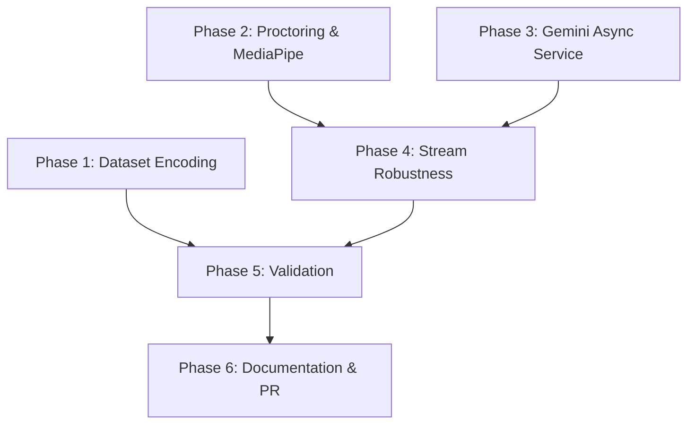

# Implementation Plan: Phase 3 Vision Pipeline Production Readiness

## 1. Plan Overview
- **Total Phases**: 6
- **Agents Involved**: `coder`, `tester`, `code_reviewer`, `technical_writer`
- **Estimated Effort**: High

## 2. Dependency Graph

## 3. Execution Strategy Table

| Phase | Name | Agent | Execution Mode | Parallel Batch |
|---|---|---|---|---|
| 1 | Foundation & Dataset | `coder` | Autonomous | 1 |
| 2 | Proctoring & MediaPipe | `coder` | Autonomous | 1 |
| 3 | Gemini Async Service | `coder` | Autonomous | 1 |
| 4 | Stream Robustness | `coder` | Autonomous | 2 |
| 5 | Validation & Review | `tester`, `code_reviewer` | Manual/Sequential | - |
| 6 | Documentation & PR | `technical_writer`, `coder` | Manual/Sequential | - |

## 4. Phase Details

### Phase 1: Foundation & Dataset Encoding
- **Objective**: Ensure the dataset of 127 students is fully encoded into the SQLite database.
- **Agent**: `coder`
- **Files to Modify**:
  - `python-api/scripts/encode_real_dataset.py`: Ensure it targets `data/StudentPicsDataset.csv` (127 rows) and correctly inserts BLOBs into `classroom_emotions.db`. Add graceful error handling for unreadable images.
- **Implementation Details**:
  - Run the script as part of the phase execution.
  - Verify the database count after execution.
- **Validation Criteria**:
  - Command: `cd python-api && python scripts/verify_db.py` (or execute a quick SQLite query) returns ~127 students.
- **Dependencies**:
  - `blocked_by`: []
  - `blocks`: [5]

### Phase 2: Proctoring & MediaPipe Integration
- **Objective**: Implement 3D head rotation detection using MediaPipe FaceMesh.
- **Agent**: `coder`
- **Files to Modify**:
  - `python-api/requirements.txt`: Add `mediapipe`.
  - `python-api/services/proctor_service.py`: Implement `check_head_rotation` using `mediapipe.solutions.face_mesh`. Must be lazily instantiated.
- **Implementation Details**:
  - `FaceMesh` object should only be created when `check_head_rotation` is first called, not on module load.
  - Return Euler angles (pitch, yaw, roll) and a boolean flag for suspicious movement.
- **Validation Criteria**:
  - Run `python-api/tests/test_vision_mock.py` or write a quick manual test script to verify angles are returned without crashing.
- **Dependencies**:
  - `blocked_by`: []
  - `blocks`: [4]

### Phase 3: Gemini Async Service Implementation
- **Objective**: Connect the real Gemini LLM for interventions using FastAPI BackgroundTasks.
- **Agent**: `coder`
- **Files to Modify**:
  - `python-api/services/gemini_service.py`: Replace mock logic with actual `google.generativeai` calls.
  - `python-api/routers/gemini.py`: Modify endpoints to accept `BackgroundTasks`, call the service, and return `202 Accepted`.
- **Implementation Details**:
  - Service must push the final LLM payload via `websocket.py` `broadcast` or `send_personal_message` when generation is complete.
- **Validation Criteria**:
  - Test via a `curl` or `pytest` to the intervention endpoint. It should return immediately.
- **Dependencies**:
  - `blocked_by`: []
  - `blocks`: [4]

### Phase 4: Stream Robustness & Final Integration
- **Objective**: Add reconnection logic to the vision loop and integrate the newly completed services.
- **Agent**: `coder`
- **Files to Modify**:
  - `python-api/services/vision_pipeline.py`: Integrate the updated `proctor_service` calls.
  - `python-api/routers/session.py`: Wrap the camera capture loop in a robust try-except with a backoff-retry mechanism (e.g., 5 reconnect attempts with 2s delay).
- **Implementation Details**:
  - Prevent the thread from dying silently. Log warnings on disconnects and info on reconnects.
- **Validation Criteria**:
  - Run `python-api/main.py`.
- **Dependencies**:
  - `blocked_by`: [2, 3]
  - `blocks`: [5]

### Phase 5: Validation & Quality Review
- **Objective**: Ensure all components work together and adhere to the architectural constraints.
- **Agent**: `tester`, `code_reviewer`
- **Files to Modify**:
  - `python-api/tests/test_vision_pipeline.py`: Add tests for stream reconnects and MediaPipe usage.
- **Implementation Details**:
  - `tester` writes tests.
  - `code_reviewer` reviews `vision_pipeline.py` and `proctor_service.py` for performance bottlenecks (lazy loading verification).
- **Validation Criteria**:
  - Command: `cd python-api && pytest tests/test_vision_pipeline.py`. All tests pass.
- **Dependencies**:
  - `blocked_by`: [1, 4]
  - `blocks`: [6]

### Phase 6: Documentation & PR
- **Objective**: Document all changes made during Phase 3 and prepare a Pull Request.
- **Agent**: `technical_writer`, `coder`
- **Files to Modify**:
  - `docs/maestro/state/archive/2026-05-07-phase-3-vision-production.md` (or a dedicated report file like `PHASE_3_COMPLETION_REPORT.md`).
- **Implementation Details**:
  - Write a comprehensive completion report detailing dataset encoding results, MediaPipe integration, Gemini async flows, and stream robustness.
  - Use `coder` to run `git` commands: stage changes, commit, and optionally prepare a branch or patch file.
- **Validation Criteria**:
  - The markdown report is written and saved.
  - `git status` shows a clean working tree with a dedicated commit ready.
- **Dependencies**:
  - `blocked_by`: [5]
  - `blocks`: []

## 5. File Inventory

| File Path | Phase | Action | Purpose |
|---|---|---|---|
| `python-api/scripts/encode_real_dataset.py` | 1 | Modify | Encode dataset |
| `python-api/requirements.txt` | 2 | Modify | Add MediaPipe |
| `python-api/services/proctor_service.py` | 2 | Modify | MediaPipe integration |
| `python-api/routers/gemini.py` | 3 | Modify | Async API |
| `python-api/services/gemini_service.py` | 3 | Modify | Real LLM calls |
| `python-api/routers/session.py` | 4 | Modify | Robustness loop |
| `python-api/services/vision_pipeline.py` | 4 | Modify | Integration |
| `python-api/tests/test_vision_pipeline.py` | 5 | Modify | Validation tests |
| `PHASE_3_COMPLETION_REPORT.md` | 6 | Create | Detailed documentation |

## 6. Risk Classification
- **Phase 1**: LOW - Standard data processing.
- **Phase 2**: HIGH - Adding a heavy vision model (MediaPipe) could impact performance.
- **Phase 3**: MEDIUM - External API dependencies and async flows are error-prone.
- **Phase 4**: HIGH - Threading and stream handling logic is fragile.
- **Phase 5**: LOW - Read-only review and testing.
- **Phase 6**: LOW - Documentation and Git operations.

## 7. Execution Profile
- Total phases: 6
- Parallelizable phases: 3 (in 1 batch: Phases 1, 2, 3)
- Sequential-only phases: 3 (Phases 4, 5, 6)

## 8. Cost Estimation

| Phase | Agent | Model | Est. Input | Est. Output | Est. Cost |
|-------|-------|-------|-----------|------------|----------|
| 1 | coder | Flash | 1500 | 500 | $0.0035 |
| 2 | coder | Flash | 2000 | 800 | $0.0052 |
| 3 | coder | Flash | 2500 | 1000 | $0.0065 |
| 4 | coder | Flash | 2500 | 800 | $0.0057 |
| 5 | tester, code_reviewer | Flash | 4000 | 1000 | $0.0080 |
| 6 | technical_writer, coder | Flash | 3000 | 1000 | $0.0070 |
| **Total** | | | **15500** | **5100** | **$0.0359** |