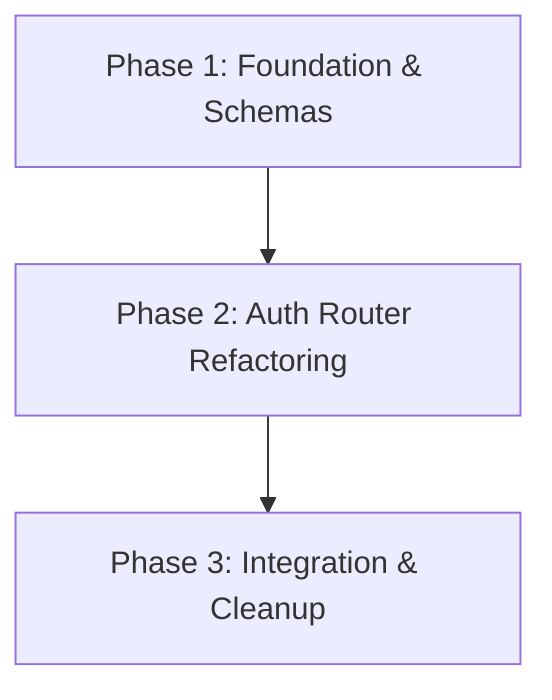

# Implementation Plan: Finalize Auth Logic (Hybrid v3)

**Task Complexity**: Medium
**Execution Mode**: Sequential

## Plan Overview
This plan refactors the authentication system to use Supabase Auth for identity management while maintaining application data in a local PostgreSQL database. It introduces a password reset flow and ensures that user roles are correctly mapped from Supabase JWT metadata to local database records.

## Dependency Graph

## Execution Strategy Table
| Stage | Phase | Agent | Execution Mode |
|-------|-------|-------|----------------|
| 1 | Phase 1: Foundation & Schemas | `api_designer` | Sequential |
| 2 | Phase 2: Auth Router Refactoring | `coder` | Sequential |
| 3 | Phase 3: Integration & Cleanup | `coder` | Sequential |

## Phase Details

### Phase 1: Foundation & Schemas
- **Objective**: Update Pydantic models to support the new auth flow and password reset flag.
- **Agent**: `api_designer`
- **Files to Modify**:
    - `python-api/schemas.py`:
        - Add `needs_password_reset: bool` to `AdminResponse`, `LecturerResponse`, and `StudentResponse`.
        - Add `PasswordResetRequest(BaseModel)` with `old_password: str` and `new_password: str`.
- **Validation**:
    - Run `python -c "from schemas import AdminResponse, PasswordResetRequest; print('Schemas loaded successfully')"` in `python-api` directory.

### Phase 2: Auth Router Refactoring
- **Objective**: Implement Supabase token verification, role mapping from JWT metadata, and the password reset endpoint.
- **Agent**: `coder`
- **Files to Modify**:
    - `python-api/routers/auth.py`:
        - Initialize Supabase client using `SUPABASE_URL` and `SUPABASE_ANON_KEY`.
        - Update `get_current_user` to:
            1. Extract JWT from Authorization header.
            2. Verify token with Supabase.
            3. Extract `sub` (UUID) and `role` from `user_metadata`.
            4. Query local DB using `auth_user_id == sub`.
        - Implement `POST /auth/reset-password`:
            1. Authenticate user via `get_current_user`.
            2. Call `supabase.auth.update_user({"password": new_password})`.
            3. Update local DB: `user.needs_password_reset = False`.
- **Validation**:
    - Mock Supabase response and verify `get_current_user` returns the correct local user.
    - Verify `reset-password` endpoint updates both Supabase (mocked) and local DB.

### Phase 3: Integration & Cleanup
- **Objective**: Ensure all dependencies are met and the system is ready for production.
- **Agent**: `coder`
- **Files to Modify**:
    - `python-api/requirements.txt`: Ensure `supabase` and `python-jose` are present.
    - `python-api/main.py`: Ensure Supabase environment variables are loaded.
- **Validation**:
    - Run `uvicorn main:app --reload` and test endpoints via Swagger UI (`/docs`).

## File Inventory
| Phase | Action | Path | Purpose |
|-------|--------|------|---------|
| 1 | Modify | `python-api/schemas.py` | Add reset flag and request model |
| 2 | Modify | `python-api/routers/auth.py` | Core auth logic refactor |
| 3 | Modify | `python-api/requirements.txt` | Dependency management |

## Risk Classification
| Phase | Risk | Rationale |
|-------|------|-----------|
| 2 | HIGH | Direct integration with external Supabase API; potential for token verification failures or UUID mismatch. |

## Execution Profile
- Total phases: 3
- Parallelizable phases: 0
- Sequential-only phases: 3
- Estimated sequential wall time: 45 minutes
