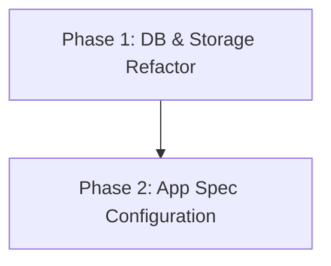

# Implementation Plan: Digital Ocean Configuration

## 1. Plan Overview
- **Total Phases**: 2
- **Agents Involved**: `coder`, `architect`
- **Estimated Effort**: 1-2 hours
- **Objective**: Refactor the codebase to use Managed PostgreSQL and Digital Ocean Spaces, then define the infrastructure in an `app.yaml` App Spec.

## 2. Dependency Graph

## 3. Execution Strategy
| Phase | Agent | Execution Mode | Parallelizable |
|-------|-------|----------------|----------------|
| 1 | `coder` | Sequential | No |
| 2 | `architect` | Sequential | No |

## 4. Phase Details

### Phase 1: Database & Storage Refactor
- **Objective**: Update the backend to support PostgreSQL and DO Spaces (S3). Update the frontend to read from S3.
- **Agent**: `coder`
- **Files to Modify**:
  - `python-api/requirements.txt`: Add `psycopg2-binary` and `boto3`.
  - `python-api/database.py`: Remove SQLite-specific checks (e.g., `check_same_thread`, `PRAGMA journal_mode=WAL`) if `DATABASE_URL` is PostgreSQL.
  - `python-api/services/export_service.py`: Refactor `export_all()` to upload generated CSVs directly to DO Spaces using `boto3` instead of saving them permanently to disk.
  - `shiny-app/global.R`: Add necessary S3 packages (e.g., `aws.s3`).
  - `shiny-app/server/admin_server.R` & `shiny-app/server/lecturer_server.R`: Update `load_csv` and file existence checks to fetch from Spaces rather than the local filesystem.
- **Validation**: 
  - Ensure `requirements.txt` parses correctly.
  - Run a basic syntax check on modified Python and R files.
- **Dependencies**: None (`blocked_by`: [])

### Phase 2: App Spec Configuration
- **Objective**: Draft the definitive `app.yaml` file for Digital Ocean App Platform.
- **Agent**: `architect`
- **Files to Create**:
  - `app.yaml`: Digital Ocean App Platform specification file.
- **Implementation Details**:
  - Define three services: `backend` (FastAPI), `frontend` (R Shiny), and `vision` (if deployed as a separate worker/service per `docker-compose.yml`).
  - Configure environment variables for the Managed DB (`DATABASE_URL`) and Spaces (`SPACES_KEY`, `SPACES_SECRET`, `SPACES_REGION`, `SPACES_BUCKET`).
  - Specify standard tiers, except for `vision` which should be assigned a higher RAM tier (e.g., `professional-xs` or similar).
- **Validation**: 
  - Inspect `app.yaml` to ensure it follows the standard Digital Ocean App Platform schema.
- **Dependencies**: `blocked_by`: [1]

## 5. File Inventory
| File | Phase | Action | Purpose |
|------|-------|--------|---------|
| `python-api/requirements.txt` | 1 | Modify | Add DB/S3 dependencies |
| `python-api/database.py` | 1 | Modify | Support PostgreSQL URL |
| `python-api/services/export_service.py` | 1 | Modify | Upload CSVs to DO Spaces |
| `shiny-app/global.R` | 1 | Modify | Add R S3 dependencies |
| `shiny-app/server/admin_server.R` | 1 | Modify | Fetch CSVs from Spaces |
| `shiny-app/server/lecturer_server.R` | 1 | Modify | Fetch CSVs from Spaces |
| `app.yaml` | 2 | Create | Define DO App Platform infra |

## 6. Risk Classification
- **Phase 1 (DB & Storage)**: MEDIUM. Requires careful handling of AWS S3 libraries in R and Python. Testing locally might be tricky without live credentials, so the code must be defensive.
- **Phase 2 (App Spec)**: LOW. The `app.yaml` format is declarative and well-documented.

## 7. Execution Profile
- Total phases: 2
- Parallelizable phases: 0
- Sequential-only phases: 2
- Estimated sequential wall time: 10 minutes

## 8. Cost Estimation
| Phase | Agent | Model | Est. Input | Est. Output | Est. Cost |
|-------|-------|-------|-----------|------------|----------|
| 1 | `coder` | Pro | 3500 | 1000 | ~$0.08 |
| 2 | `architect` | Pro | 1000 | 500 | ~$0.03 |
| **Total** | | | **4500** | **1500** | **~$0.11** |