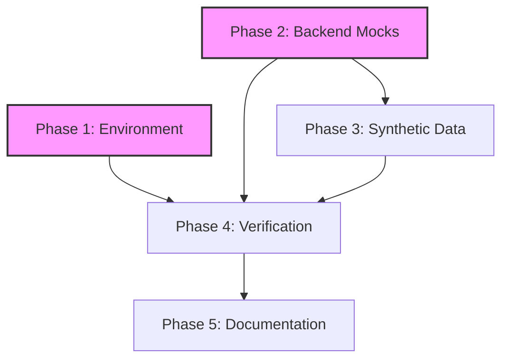

# Implementation Plan: Milestone 1 Completion

## 1. Plan Overview
This plan focuses on closing the technical and documentation gaps for Milestone 1. We will parallelize environment setup and backend refactoring to unblock the testing and documentation phases.

- **Total Phases**: 5
- **Agents Involved**: `devops_engineer`, `coder`, `tester`, `technical_writer`
- **Estimated Effort**: Medium

## 2. Dependency Graph

## 3. Execution Strategy
| Stage | Phases | Execution Mode | Rationale |
|-------|--------|----------------|-----------|
| 1 | 1, 2 | **Parallel** | Environment and Code logic are independent. |
| 2 | 3 | Sequential | Requires Phase 2 models to be ready. |
| 3 | 4 | Sequential | Full system validation. |
| 4 | 5 | Sequential | Final report on completed work. |

## 4. Phase Details

### Phase 1: Environment Foundation
- **Objective**: Fix the Python environment to support AI/ML detection tasks.
- **Agent**: `devops_engineer`
- **Files to Modify**:
  - `python-api/requirements.txt`: Add `ultralytics`, `hsemotion`, `face-recognition`, `google-generativeai`.
  - `vision/Dockerfile`: Add `libgl1-mesa-glx`, `libglib2.0-0` (required by OpenCV).
- **Validation**: `pip install -r requirements.txt` succeeds.

### Phase 2: Database-Backed Mock API
- **Objective**: Refactor static mocks to use the real SQLite database.
- **Agent**: `coder`
- **Files to Modify**:
  - `python-api/main.py`: Update router inclusions.
  - `python-api/routers/*.py`: Refactor all 21+ existing mocks to use `db: Session`.
  - `python-api/routers/roster.py`, `python-api/routers/upload.py`: Implement missing mocks.
- **Implementation Details**:
  - Use `Depends(get_db)` in every endpoint.
  - Ensure `POST /auth/login` actually issues a JWT and checks the `Student` table.
- **Validation**: API starts with `uvicorn` and initial smoke test of `/health` passes.

### Phase 3: Synthetic Data Seeding
- **Objective**: Populate the database with 50-100 rows of test data.
- **Agent**: `coder`
- **Files to Create**:
  - `python-api/scripts/seed_mock_data.py`: Script using SQLAlchemy to INSERT students, lectures, and emotions.
- **Validation**: Run script; verify row counts in `classroom_emotions.db`.

### Phase 4: Full System Verification
- **Objective**: Ensure all Phase 1 criteria are met.
- **Agent**: `tester`
- **Steps**:
  - Run `python-api/scripts/verify_db.py`.
  - Run a batch test (using `curl` or a script) on all 30+ endpoints.
- **Validation**: 100% pass rate on health and mock endpoints.

### Phase 5: Final Documentation
- **Objective**: Create the Milestone 1 completion report.
- **Agent**: `technical_writer`
- **Files to Create**:
  - `MILESTONE_1_REPORT.md`: Detailed explanation of finished tasks, schemas, and usage.
- **Validation**: Markdown is well-formatted and covers all 5 phases.

## 5. File Inventory
| Phase | Action | Path | Purpose |
|-------|--------|------|---------|
| 1 | Modify | `python-api/requirements.txt` | AI Dependencies |
| 1 | Modify | `vision/Dockerfile` | System dependencies |
| 2 | Modify | `python-api/routers/*.py` | DB-backed mocks |
| 3 | Create | `python-api/scripts/seed_mock_data.py` | Data seeder |
| 5 | Create | `MILESTONE_1_REPORT.md` | Completion summary |

## 6. Execution Profile
- **Total phases**: 5
- **Parallelizable phases**: 2 (Phase 1 & 2)
- **Sequential phases**: 3
- **Wall Time Estimate**: ~3-4 turns for implementation + 2 turns for validation/docs.

## 7. Cost Estimation
| Phase | Agent | Model | Est. Input | Est. Output | Est. Cost |
|-------|-------|-------|-----------|------------|----------|
| 1 | `devops_engineer` | Flash | 5K | 1K | $0.01 |
| 2 | `coder` | Pro | 20K | 5K | $0.40 |
| 3 | `coder` | Pro | 10K | 2K | $0.18 |
| 4 | `tester` | Flash | 5K | 1K | $0.01 |
| 5 | `technical_writer` | Pro | 10K | 3K | $0.22 |
| **Total** | | | **50K** | **12K** | **~$0.82** |
