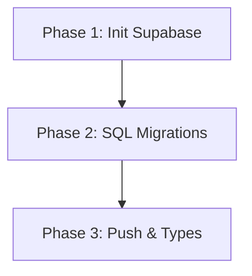

# Implementation Plan: Supabase Schema Migration

## 1. Plan Overview
- **Total Phases**: 3
- **Agents Involved**: `devops_engineer`, `data_engineer`
- **Estimated Effort**: Low (mostly command execution and file splitting)

## 2. Dependency Graph


## 3. Execution Strategy
| Stage | Phases | Agent | Execution Mode | Parallel |
|-------|--------|-------|----------------|----------|
| 1 | 1 | `devops_engineer` | Sequential | No |
| 2 | 2 | `data_engineer` | Sequential | No |
| 3 | 3 | `devops_engineer` | Sequential | No |

## 4. Phase Details

### Phase 1: Initialize Supabase
- **Objective**: Bootstrap the local Supabase environment and link it to the remote project.
- **Agent**: `devops_engineer`
- **Files to Create/Modify**: None (CLI manages its own `.supabase` / `supabase/` config)
- **Implementation Details**:
  - Run `npx supabase init` to create the local `supabase/` directory.
  - Run `npx supabase link --project-ref asefcgykjadlekhwwzar` to link to the remote database.
  - Ensure the `supabase/migrations` directory exists (create if not generated by init).
- **Validation Criteria**:
  - `Get-ChildItem supabase/` should show config files and a `migrations` folder.
- **Dependencies**: `blocked_by`: []

### Phase 2: Create SQL Migrations
- **Objective**: Split the provided schema from `data-schema/README.md` into discrete migration files.
- **Agent**: `data_engineer`
- **Files to Create**:
  - `supabase/migrations/20260509000001_01_schema.sql`: Contains the table creations (Admins, Lecturers, Students, Courses, Classes, Class Schedule, Enrollments, Lectures, Exams, Materials, Emotion Log, Attendance Log, Incidents, Notifications, Focus Strikes). Ensure no RLS policies are in this file.
  - `supabase/migrations/20260509000002_02_rls.sql`: Contains `ALTER TABLE ... ENABLE ROW LEVEL SECURITY` and `CREATE POLICY ...` commands.
  - `supabase/migrations/20260509000003_03_auth_hooks.sql`: Contains the `custom_jwt_claims` function creation.
- **Implementation Details**:
  - Extract the SQL sections accurately from `data-schema/README.md`.
  - Maintain the exact order of table creations to satisfy foreign key dependencies.
- **Validation Criteria**:
  - The three `.sql` files exist in `supabase/migrations/` and contain valid PostgreSQL syntax.
- **Dependencies**: `blocked_by`: [1]

### Phase 3: Push Migrations, Gen Types & Connect Repo
- **Objective**: Apply migrations, generate TypeScript types, and configure project environment variables.
- **Agent**: `devops_engineer`
- **Files to Create/Modify**:
  - `supabase/database.types.ts`: Generated file.
  - `python-api/.env`: Update with Supabase URL and keys.
  - `react-native-app/.env`: Update with Supabase URL and keys.
- **Implementation Details**:
  - Run `npx supabase db push` (Requires `SUPABASE_ACCESS_TOKEN`).
  - Run `npx supabase gen types typescript --project-id asefcgykjadlekhwwzar > supabase/database.types.ts`.
  - Update `.env` files in `python-api/` and `react-native-app/` with the project URL and anon key.
- **Validation Criteria**:
  - Tables exist in remote DB.
  - `database.types.ts` is populated.
  - `.env` files contain the correct Supabase credentials.
- **Dependencies**: `blocked_by`: [2]

## 5. File Inventory
| File | Phase | Purpose |
|------|-------|---------|
| `supabase/migrations/20260509000001_01_schema.sql` | 2 | Table structures |
| `supabase/migrations/20260509000002_02_rls.sql` | 2 | RLS Policies |
| `supabase/migrations/20260509000003_03_auth_hooks.sql` | 2 | Custom JWT Claims |
| `supabase/database.types.ts` | 3 | Type safety for clients |

## 6. Risk Classification
- **Phase 1**: LOW - Standard CLI commands.
- **Phase 2**: MEDIUM - Requires careful SQL extraction to ensure FK constraints and policy logic remain intact.
- **Phase 3**: MEDIUM - Network-dependent. Could fail if the token is invalid or if migrations have syntax errors.

## 7. Execution Profile
```
Execution Profile:
- Total phases: 3
- Parallelizable phases: 0 (in 0 batches)
- Sequential-only phases: 3
- Estimated parallel wall time: N/A
- Estimated sequential wall time: 3-5 minutes

Note: Native parallel execution currently runs agents in autonomous mode.
All tool calls are auto-approved without user confirmation.
```

## 8. Plan-Level Cost Summary
| Phase | Agent | Model | Est. Input | Est. Output | Est. Cost |
|-------|-------|-------|-----------|------------|----------|
| 1 | `devops_engineer` | Pro | 1000 | 100 | < $0.01 |
| 2 | `data_engineer` | Pro | 2500 | 2500 | ~ $0.12 |
| 3 | `devops_engineer` | Pro | 1000 | 500 | ~ $0.03 |
| **Total** | | | **4500** | **3100** | **~ $0.15** |
