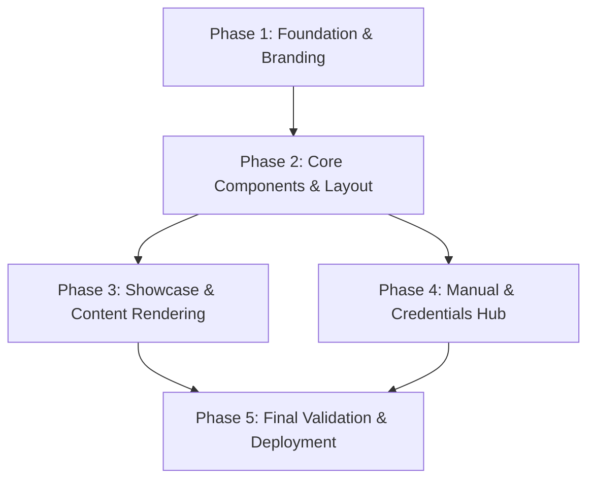

# Implementation Plan: Classroom Emotion System Showcase Portal

## 1. Plan Overview
This plan decomposes the creation of a hybrid React/Tailwind showcase website into 5 focused phases. We will use a team of 3 agents (UX Designer, Coder, Technical Writer) to ensure a high-quality, institutionally-aligned result.

**Execution Mode**: Sequential (Recommended for state consistency).

## 2. Dependency Graph

## 3. Execution Strategy Table

| Phase | Objective | Agent | Parallel |
| :--- | :--- | :--- | :--- |
| **1** | Scaffold Vite/React, Tailwind config, and AAST theme variables. | `ux_designer` | No |
| **2** | Implement Header, Footer, and Hybrid Layout with Routing. | `coder` | No |
| **3** | Build Home Page (Story/Video) and Markdown renderer for docs. | `coder` | Yes |
| **4** | Create 'MANUAL.md' and the Testing Credentials page. | `technical_writer`| Yes |
| **5** | Build, link validation, and production readiness. | `coder` | No |

## 4. Phase Details

### Phase 1: Foundation & Branding
- **Objective**: Establish the technical and visual base for the showcase site.
- **Agent**: `ux_designer`
- **Files to Create**:
  - `showcase-site/tailwind.config.ts`: Define AAST Navy (`#002244`) and Gold (`#C49808`).
  - `showcase-site/src/index.css`: Setup Tailwind layers.
- **Validation**: `npm run dev` to verify AAST color swatches in a test div.

### Phase 2: Core Components & Layout
- **Objective**: Build the shell of the application including navigation.
- **Agent**: `coder`
- **Files to Create**:
  - `showcase-site/src/components/Header.tsx`: AAST logo and top nav.
  - `showcase-site/src/components/Sidebar.tsx`: Persistent nav for doc sections.
  - `showcase-site/src/layouts/MainLayout.tsx`: The grid for story vs docs views.
- **Validation**: Navigate between `/` and `/docs` to confirm layout shifts.

### Phase 3: Showcase & Content Rendering
- **Objective**: Implement the storytelling Home page and dynamic doc rendering.
- **Agent**: `coder`
- **Files to Create**:
  - `showcase-site/src/pages/Home.tsx`: Hero section with YouTube embed.
  - `showcase-site/src/components/MarkdownRenderer.tsx`: Using `react-markdown`.
- **Validation**: Verify `ARCHITECTURE.md` content is rendered and styled via Typography plugin.

### Phase 4: Manual & Credentials Hub
- **Objective**: Provide the "how-to" depth for examiners.
- **Agent**: `technical_writer`
- **Files to Create**:
  - `showcase-site/src/docs/MANUAL.md`: Write the project manual based on existing logs.
  - `showcase-site/src/pages/Manual.tsx`: Presentation of testing credentials and links.
- **Validation**: Ensure all project links (FastAPI, Shiny) are active and labeled.

### Phase 5: Final Validation & Deployment
- **Objective**: Ensure the site is bug-free and ready for DigitalOcean.
- **Agent**: `coder`
- **Validation**: `npm run build` to verify zero build errors. Responsive check on 375px, 768px, and 1440px widths.

## 5. Cost Estimation

| Phase | Agent | Model | Est. Input | Est. Output | Est. Cost |
| :--- | :--- | :--- | :--- | :--- | :--- |
| 1 | `ux_designer`| Flash | 15K | 2K | $0.03 |
| 2 | `coder` | Flash | 20K | 4K | $0.04 |
| 3 | `coder` | Flash | 20K | 4K | $0.04 |
| 4 | `technical_writer`| Flash | 15K | 3K | $0.03 |
| 5 | `coder` | Flash | 10K | 2K | $0.02 |
| **Total**| | | **80K** | **15K** | **$0.16** |

## 6. Execution Profile
- **Total phases**: 5
- **Parallelizable phases**: 2 (Phase 3 & 4)
- **Sequential-only phases**: 3
- **Estimated wall time**: 4-6 agent turns.

**Note**: All tool calls in this implementation will be auto-approved per Maestro protocol.
